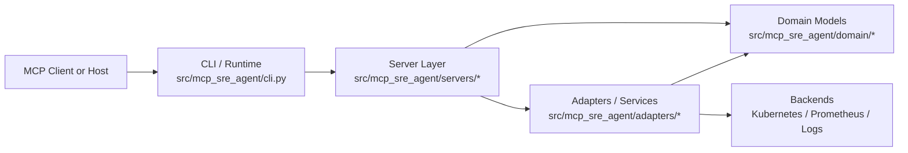
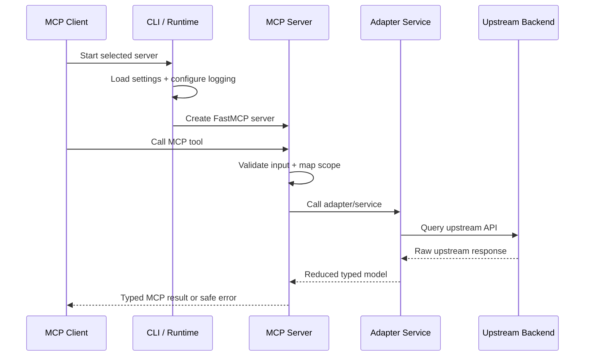
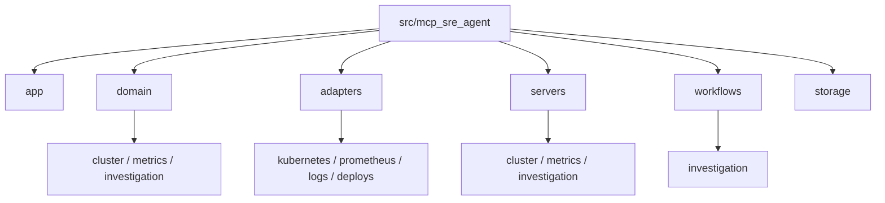

# Platform Architecture

## Summary

This document describes the architecture of the `mcp-sre-agent` platform as it exists today and the target architecture we are building toward. The project is intended to provide a set of SRE-focused MCP servers for Kubernetes, metrics, logs, investigation, and operational workflows.

The current implementation is intentionally small. It contains one server, `cluster`, and one tool, `list_nodes`. That is sufficient to validate the project direction, but it is not yet the final shape of the platform. This document should be treated as the architectural guide for contributors and the source of truth for future structural decisions.

## Goals

The platform is being designed to:

- expose operational capabilities through MCP servers and tools
- support Kubernetes, metrics, logs, and investigation workflows
- keep tool responses typed, reduced, and safe to expose to LLM-driven clients
- run in local development, Docker, and Kubernetes environments
- remain maintainable as the number of servers, tools, and adapters grows
- preserve a conservative security posture around secrets, credentials, and sensitive runtime data

## Non-Goals

The platform is not intended to:

- act as a raw pass-through proxy for upstream APIs
- expose unrestricted infrastructure access without scope or guardrails
- rely on free-form autonomous agent behavior for core evidence collection
- couple MCP tool contracts directly to upstream backend schemas
- optimize prematurely for every future use case before the first vertical slices are stable

## Current Architecture

The current codebase follows a layered structure under `src/mcp_sre_agent/`.

```text
src/mcp_sre_agent/
  app/
  adapters/
  domain/
  servers/
  storage/
  workflows/
```



### Current implemented layers

#### `app/`

Application-level runtime concerns.

Current responsibilities:

- settings loading via `pydantic-settings`
- logging configuration
- startup logging

#### `adapters/`

Backend integration layer.

Current responsibilities:

- Kubernetes client creation
- Kubernetes configuration loading
- sanitization of Kubernetes API failures
- reduction of Kubernetes node data into typed summaries

#### `domain/`

Typed models used as the public contract between adapters and MCP tools.

Current responsibilities:

- cluster models such as `NodeSummary` and `ListNodesResult`
- shared primitives for scope, time windows, error categories, and response metadata

#### `servers/`

FastMCP server construction and tool registration.

Current responsibilities:

- cluster server creation
- server registry
- MCP tool registration

#### `storage/`

Reserved for persistence and cache integrations.

Current responsibilities:

- none yet

#### `workflows/`

Reserved for cross-domain orchestration such as investigation flows.

Current responsibilities:

- none yet

## Current Runtime Flow

1. The process starts through `mcp_sre_agent.cli`.
2. Settings are loaded from `MCP_*` environment variables.
3. Logging is configured.
4. Startup logs print the selected server, transport, bind address, and sanitized Kubernetes connection intent.
5. The CLI creates the selected FastMCP server through the server registry.
6. The server runs using `stdio`, `sse`, or `streamable-http`.
7. A client invokes an MCP tool.
8. The server delegates to an adapter-backed service.
9. The adapter talks to the upstream system and returns a reduced typed model.
10. The MCP server returns that typed result to the client.



## Architectural Principles

The platform should preserve these rules as it grows.

### 1. Thin server layer

The MCP server layer should only:

- validate or shape MCP-facing inputs and outputs
- register tools, prompts, and resources
- handle safe translation of upstream or adapter errors

It should not contain complex backend logic.

### 2. Adapter isolation

Each external system should be isolated behind an adapter or service object.

Examples:

- Kubernetes adapter
- Prometheus adapter
- log backend adapter
- deploy-change adapter

This isolates vendor-specific APIs from the MCP surface.

### 3. Typed domain contracts

All MCP tools should return reduced typed models, not raw payloads.

Benefits:

- lower token cost
- smaller attack surface
- clearer compatibility guarantees
- better testability

### 4. Security by reduction

The platform should prefer:

- reduced responses
- explicit scope and limits
- sanitized errors
- redacted logs

It should avoid:

- raw secret-bearing manifests
- raw upstream exception bodies
- unrestricted dump-style tools

### 5. Deterministic collection before agentic reasoning

The system should collect evidence deterministically first. Model-driven reasoning should rank, summarize, and explain evidence after collection, not replace collection.

## Target Platform Capabilities

The long-term platform is expected to include at least these capability groups.

### Cluster server

Responsibilities:

- list and inspect nodes
- list and inspect pods, deployments, services, namespaces
- fetch rollout status
- fetch recent events
- inspect resource health and recent state transitions

### Metrics server

Responsibilities:

- instant metric queries
- range metric queries
- health-oriented metric helpers
- restart, error, and saturation checks
- bounded statistical summaries over time windows

### Logs server

Responsibilities:

- scoped log queries
- error clustering
- service-specific excerpts
- deploy-correlated log retrieval

### Investigation server

Responsibilities:

- build bounded incident scope
- collect evidence across systems
- rank hypotheses
- synthesize findings and next probes
- support future persistence or workflow state

### Runbook and knowledge resources

Responsibilities:

- expose reusable operational context
- provide ownership, topology, or runbook resources
- support prompt scaffolds for investigations and operational guidance

## Scaling Concerns and Current Mitigations

The first version of the project used flatter modules for the cluster server, Kubernetes adapter, and cluster domain models. That would not have scaled well once pods, workloads, events, and metrics tooling were added.

The codebase has now been moved to a more scalable shape for the cluster slice:

- `servers/cluster/` contains server construction and tool-family registration modules
- `adapters/kubernetes/` contains configuration, client construction, and node operations separately
- `domain/cluster/` contains cluster-specific models by object family

This refactor removes the immediate scaling pressure from the first slice, but the same discipline must be preserved as new domains are added.

## Recommended Structure Evolution

The codebase has already started evolving from a flat layered layout to a layered plus feature-partitioned layout.

Recommended target structure:

```text
src/mcp_sre_agent/
  app/
    config.py
    logging.py
    security.py
  domain/
    common/
    cluster/
      nodes.py
      pods.py
      workloads.py
      events.py
    metrics/
      queries.py
      health.py
    investigation/
      scope.py
      evidence.py
      hypotheses.py
  adapters/
    kubernetes/
      config.py
      client.py
      nodes.py
      pods.py
      workloads.py
      events.py
    prometheus/
      client.py
      queries.py
      reducers.py
    logs/
      client.py
      queries.py
    deploys/
      client.py
  servers/
    cluster/
      server.py
      tools_nodes.py
      tools_pods.py
      tools_workloads.py
      tools_events.py
    metrics/
      server.py
      tools_queries.py
      tools_health.py
    investigation/
      server.py
      tools_investigations.py
  workflows/
    investigation/
      collect.py
      reduce.py
      rank.py
      synthesize.py
  storage/
    cache/
    repository/
tests/
  adapters/
  domain/
  servers/
  workflows/
```



### Why this structure scales better

#### Server modules stay readable

Instead of one `cluster.py` file registering every cluster tool, the cluster server can be split into focused registration modules such as `tools_nodes.py` and `tools_pods.py`.

#### Adapter responsibilities stay narrow

Kubernetes-specific logic can be partitioned by object family rather than accumulated in one file.

#### Domain models stay discoverable

A contributor looking for node output models should not need to search a large `cluster.py` domain file shared with pods, workloads, and events.

#### Tests can mirror the runtime structure

When test layout matches code layout, contributors can find coverage gaps faster and understand responsibilities more easily.

## Recommended Codebase Improvements Now

The initial package refactor is complete. The next structural improvements should focus on shared primitives and future domains.

### 1. Introduce shared error types

Today, error handling is local to the Kubernetes adapter. As more backends are added, common error categories should be defined centrally.

Recommended future location:

- `app/security.py` or `domain/common/errors.py`

### 2. Introduce common scope and time-window models

Many future tools will need shared models for:

- cluster identity
- namespace scope
- workload scope
- service scope
- time window

These should be created before metrics and investigation features expand.

### 3. Add a docs map

As the project grows, `docs/` should include:

- platform architecture
- configuration reference
- contributing guide
- per-server architecture docs
- operational runbooks

This prevents contributor knowledge from staying trapped in code and chat history.

## Deployment Model

The platform is designed to support these deployment modes.

### Local development

Typical transport:

- `streamable-http` for manual testing
- `stdio` when launched by an MCP host

Typical configuration:

- local kubeconfig
- local environment variables

### Docker

Typical transport:

- `streamable-http`

Typical configuration:

- bind to `0.0.0.0`
- inject `MCP_*` environment variables
- mount kubeconfig only if local kube access is required

### Kubernetes

Typical transport:

- `streamable-http`

Typical configuration:

- in-cluster auth
- service and ingress routing as needed
- `MCP_HOST=0.0.0.0`
- path and port defined by deployment values

## Security Model

The platform should assume that MCP clients may pass untrusted inputs and that LLM-driven consumers may attempt to over-request data.

Current and intended controls include:

- bounded, purpose-built tools instead of unrestricted dump tools
- redacted startup logs
- sanitized upstream exceptions
- explicit runtime configuration instead of hidden defaults
- typed reduction layers between backends and MCP outputs

Future tools must preserve this approach.

## Observability Model

The project should eventually expose internal telemetry for:

- startup configuration summary without secrets
- MCP request counts and latency
- upstream request counts and latency
- error categories by backend and tool
- cache hit rates when caching is introduced

This is not yet implemented.

## TODO

The following items are planned or strongly recommended for later development.

### Foundation and structure

- [x] Refactor the Kubernetes adapter into a package with `config`, `client`, and object-family modules.
- [x] Refactor the cluster server into a package with per-tool registration modules.
- [x] Refactor cluster domain models into a package with object-family modules.
- [x] Add shared domain models for scope, time windows, errors, and common metadata.
- [ ] Add a repository-wide contributing guide.
- [ ] Add a configuration reference document for all `MCP_*` environment variables.

### Cluster capabilities

- [ ] Add `get_node`.
- [ ] Add namespace-scoped pod listing.
- [ ] Add workload rollout inspection.
- [ ] Add recent event retrieval.
- [ ] Add service and namespace inspection.

### Metrics capabilities

- [ ] Add a Prometheus adapter.
- [ ] Add a metrics MCP server.
- [ ] Add bounded instant and range query tools.
- [ ] Add health-oriented metric helpers.

### Logs and deploy correlation

- [ ] Add a logs adapter and logs server.
- [ ] Add deploy-change correlation.
- [ ] Add reduced log excerpt and error-clustering flows.

### Investigation workflows

- [ ] Add incident scope models.
- [ ] Add evidence record and hypothesis models.
- [ ] Add deterministic multi-source collection workflow.
- [ ] Add synthesis and ranking over normalized evidence.
- [ ] Add persistence for investigation history if required.

### Runtime and operations

- [ ] Add health or readiness endpoints for HTTP deployment.
- [ ] Add internal telemetry and tracing.
- [ ] Add cache and persistence integrations where justified.
- [ ] Add container and Kubernetes deployment manifests or Helm chart support.
- [ ] Add CI validation for tests and documentation checks.

### Security and governance

- [ ] Add shared error categories and sanitization helpers.
- [ ] Review every future tool for secret leakage and oversized response risks.
- [ ] Define policy for read-only versus mutating tools.
- [ ] Add response-size and scope guardrails where needed.

## Contributor Guidance

If you are adding a new capability to this platform:

1. start from the operator use case
2. define a typed domain contract first
3. build the backend adapter second
4. expose the MCP tool third
5. add tests for both behavior and sanitization
6. update the relevant document in `docs/`

This sequence should keep the platform maintainable as the number of tools increases.


