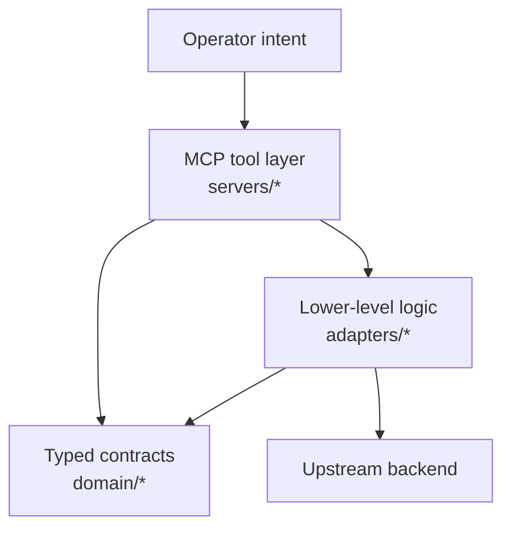
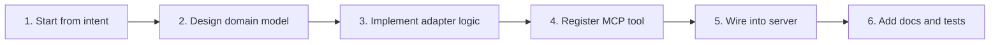
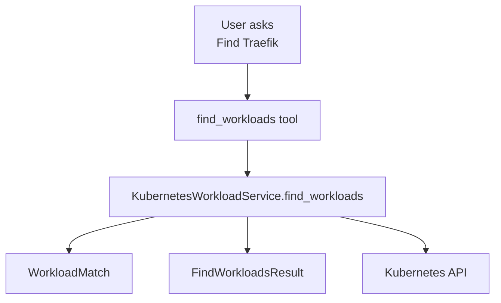

# How To Add MCP Tools

## Summary

This document explains how to add a new MCP tool or a new lower-level helper in this repository without guessing where code belongs.

The short rule is:

- define MCP-facing tools in `src/mcp_sre_agent/servers/`
- define backend logic in `src/mcp_sre_agent/adapters/`
- define typed results in `src/mcp_sre_agent/domain/`
- keep cross-tool validation and error helpers in shared server utilities

If you mix these layers, the codebase will turn into trash as the number of tools grows.

## Mental Model

There are three levels of code for one capability.

### 1. MCP tool layer

This is the public entrypoint that the model calls.

Location example:

- `src/mcp_sre_agent/servers/cluster/tools_workloads.py`

Responsibilities:

- register the tool with `@server.tool(...)`
- provide an LLM-friendly name and description
- validate simple MCP inputs
- call the adapter/service layer
- map internal exceptions to safe MCP errors

This layer must stay thin.

### 2. Lower-level service or adapter layer

This is the real implementation logic.

Location examples:

- `src/mcp_sre_agent/adapters/kubernetes/workloads.py`
- future: `src/mcp_sre_agent/adapters/prometheus/queries.py`

Responsibilities:

- call upstream APIs
- normalize vendor-specific responses
- apply bounded query logic
- hide backend-specific details from the server layer

If a tool does real work, that work belongs here, not in the MCP decorator function.

### 3. Domain model layer

This defines the typed contract returned to the MCP client.

Location examples:

- `src/mcp_sre_agent/domain/cluster/workloads.py`
- `src/mcp_sre_agent/domain/common/`

Responsibilities:

- define reduced Pydantic models
- keep outputs stable and predictable
- prevent raw backend payloads from leaking into the MCP surface

## Where To Put New Code

Use this decision table.

### Add a new tool in an existing server

If the capability belongs to an existing server, add it under that server package.

Examples:

- new cluster node tool: `src/mcp_sre_agent/servers/cluster/tools_nodes.py`
- new cluster workload tool: `src/mcp_sre_agent/servers/cluster/tools_workloads.py`

If the file is getting too broad, split by object family or use case. Do not dump everything into one giant file.

### Add a new lower-level helper used by several tools

If multiple tools share the same validation, error mapping, or small orchestration rule, put it in a shared helper.

Current example:

- `src/mcp_sre_agent/servers/tooling.py`

Put logic here only if it is reusable across more than one tool.

### Add new backend logic

If the code talks to Kubernetes, Prometheus, logs, or another backend, it belongs in `adapters/`.

Examples:

- Kubernetes deployment lookup: `src/mcp_sre_agent/adapters/kubernetes/workloads.py`
- future Prometheus instant query: `src/mcp_sre_agent/adapters/prometheus/queries.py`

### Add new output schemas

If a tool returns a new shape, define it in `domain/`.

Examples:

- cluster-related outputs: `src/mcp_sre_agent/domain/cluster/`
- common reusable outputs or scopes: `src/mcp_sre_agent/domain/common/`

## Step-By-Step Workflow

Follow this order every time.

### 1. Start from operator intent

Write down what the user is really asking.

Examples:

- "Show me the pods behind Traefik"
- "Check whether this deployment is healthy"
- "Find workloads matching ingress"

Do not start from Kubernetes object types. Start from the operator question.

### 2. Design the response model

Add or update a model in `domain/`.

Example:

- `WorkloadPodsResult`
- `WorkloadHealthResult`
- `FindWorkloadsResult`

If you cannot describe the output cleanly, the tool is not designed well enough yet.

### 3. Implement backend logic

Add the real logic in an adapter/service under `adapters/`.

Example:

- `KubernetesWorkloadService.find_workloads(...)`

This layer should:

- call the backend API
- reduce the results
- raise sanitized internal exceptions

### 4. Register the MCP tool

Add the MCP-facing function in the right `servers/.../tools_*.py` module.

This layer should:

- validate inputs
- call the service
- expose an intent-rich description

Descriptions matter. They are part of the routing contract for the LLM.

### 5. Register the tool family in the server

If you add a new tool module, wire it into the server constructor.

Example:

- `src/mcp_sre_agent/servers/cluster/server.py`

### 6. Add docs and tests

At minimum:

- update the relevant docs in `docs/`
- add or update tests if the repo has the test layout available

## Worked Example

This is the pattern for adding a new discovery-style Kubernetes tool.

### Goal

User asks:

- "Find Traefik"
- "What workload matches ingress?"

### Files to touch

- domain: `src/mcp_sre_agent/domain/cluster/workloads.py`
- adapter: `src/mcp_sre_agent/adapters/kubernetes/workloads.py`
- server tool: `src/mcp_sre_agent/servers/cluster/tools_workloads.py`

### What each layer does

Domain:

- add `WorkloadMatch`
- add `FindWorkloadsResult`

Adapter:

- add `find_workloads(query, namespace=None, limit=20)`
- list services, deployments, statefulsets, and daemonsets
- return reduced matches

Server:

- register `find_workloads`
- validate `query` and `limit`
- provide a description that mentions user intents like "traefik", "ingress", and "find workload"

## Tool Description Rules

Bad descriptions:

- "Get one deployment status summary"
- "List workload pods"

These are backend-shaped and weak for LLM routing.

Good descriptions:

- "Use when the user asks whether a deployment is healthy or fully rolled out."
- "Use when the user asks to show the pods behind a service or workload such as Traefik."

Every tool description should answer:

- what question this tool solves
- what kind of user phrasing should trigger it
- what scope the caller must already know

## When To Create A New Tool Module

Create a new `tools_*.py` module when:

- a server gains a new object family
- a file is becoming too large
- the tools share one clear purpose

Examples:

- `tools_events.py`
- `tools_services.py`
- `tools_diagnostics.py`

Do not create tiny fragmented files for one trivial function. Split by coherent families, not by ego.

## When To Create A New Server

Create a new server when:

- the backend domain is different
- the tool family has different operational concerns
- the server would otherwise become too broad

Examples:

- `cluster` server for Kubernetes state
- future `metrics` server for Prometheus queries
- future `investigation` server for multi-source evidence flows

Do not shove metrics, logs, and cluster state into one giant MCP server unless you want a maintenance mess.

## Common Mistakes

- putting Kubernetes API calls directly in the `@server.tool` function
- returning raw backend objects
- writing generic tool descriptions that do not match user phrasing
- duplicating validation logic instead of using shared helpers
- adding high-cardinality tools without namespace, selector, or limit

## Contributor Checklist

Before opening a PR or considering the tool complete, check all of these:

- the operator intent is clear
- the output model is typed and reduced
- backend logic lives in `adapters/`
- MCP registration lives in `servers/`
- descriptions are written for LLM routing, not just human developers
- shared logic is reused instead of copied
- docs are updated

## Current Reference Files

Use these files as the current reference implementation:

- `src/mcp_sre_agent/servers/cluster/tools_workloads.py`
- `src/mcp_sre_agent/adapters/kubernetes/workloads.py`
- `src/mcp_sre_agent/domain/cluster/workloads.py`
- `src/mcp_sre_agent/servers/tooling.py`
- `src/mcp_sre_agent/servers/cluster/server.py`

If you follow those patterns, you will land in roughly the right place.
